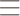

# 🧱 A-5 Dev Stack Builder Website

## 📅 Deadlines
- 60 Marks: 13th September, 2026 (11:59 PM ⏱️)
- 50 Marks: No deadline for 50 marks.
- 30 Marks: Any time after the 60 marks window.

---

## 🚫 Key Rules
- Don't ask about mark distribution in the group. We don't provide it.
- Don't post assignment feedback after you receive it. If you face any problem or have any complaints, join a support session and discuss it.
- Don't use any lorem ipsum text, rather use relevant and meaningful text content.
- You can change the color if you want, but remember that it should not be a gobindo color.
- Use at least 8 git commits with meaningful messages.


---

## 🧩 Features & Requirements (50 Marks)

### 🧭 Navbar
- Navbar designed according to the UI.
- Left: brand logo + "Dev Stack" name.
- Center: nav links — Home, Technologies, Projects, About, Contact.
- Right: "Sign In" (text button) and "Sign Up" (filled pill button).
- Navbar stays sticky at the top while scrolling.

---

### 🍔 Mobile Navbar
- On small devices the navbar has three parts:
  - Left: hamburger menu icon
  - Center: brand logo
  - Right: Sign In and Sign Up buttons



---

### 🎯 Banner / Hero
- Banner section includes:
  - Heading (two-tone: plain text + gradient text)
  - Description text
  - Two buttons — "Explore Technologies" (gradient) and "Learn More" (outlined)
  - Banner image

---

### 📦 JSON Data
Create 10-15 technology data with:
- id
- name
- category (Frontend / Backend / Database / Language / Styling / DevOps / Tools)
- description
- icon (image URL)
- rating (example: 4.8)
- difficulty (Beginner-Friendly / Intermediate / Advanced)
- badge (example: Popular, Fast, Essential, Containers)

**Example:**

```json
[
  {
    "id": "react",
    "name": "React",
    "category": "Frontend",
    "description": "A declarative, component-based JavaScript library for building modern user interfaces.",
    "icon": "https://icon.icepanel.io/Technology/svg/React.svg",
    "rating": 4.9,
    "difficulty": "Beginner-Friendly",
    "badge": "Popular"
  },
  {
    "id": "postgresql",
    "name": "PostgreSQL",
    "category": "Database",
    "description": "A powerful, open-source object-relational database system with proven reliability.",
    "icon": "https://icon.icepanel.io/Technology/svg/PostgresSQL.svg",
    "rating": 4.9,
    "difficulty": "Intermediate",
    "badge": "Top SQL"
  }
]
```

🚩 You can take help of AI Systems for generating the JSON Data.

🚩 Load the data from the JSON file — do not hardcode the array inside the component.

---

### 🃏 Technology Cards
- Display all technologies in a 3-column layout (responsive: 1 column on mobile, 2 on tablet).
- Each card includes:
  - Icon
  - Badge
  - Name
  - Description
  - Category chip
  - Difficulty
  - Rating with a star
  - "Add to Stack" button

---

### 🧰 Your Stack Section (Sidebar)
- A "Your Stack" panel sits beside the technology grid.
- Shows a heading and the selected count — example: "2 Technology Selected".
- By default the panel shows an empty message.

| Empty state | With selected items |
| --- | --- |
|  |  |

---

### ➕ Add to Stack Functionality
- Clicking "Add to Stack" adds that technology to the "Your Stack" panel.
- Each stack item shows: icon, name, category, and a remove (✕) button.
- Stack layout: 1 column.
- **The same technology cannot be added twice.** Trying again shows a warning alert.

- Once added, that card's button becomes disabled and reads "✓ Added to Stack".

---

### ❌ Remove Functionality
- Clicking the ✕ button on a stack item removes only that item from the stack.
- "Remove All" button clears the whole stack at once.

---

### 🦶 Footer
- Footer designed based on the UI.
- Brand block: logo, name, short description, social links (GitHub, Twitter, LinkedIn).
- Three link groups: Product, Company, Legal.
- Bottom bar: copyright text + Privacy and Terms links.

---

### 📱 Responsive Design
- Fully responsive across mobile, tablet, and desktop.
- Follow standard responsive practices.

---

# 🚀 Challenges Part (10 Marks)

### 🔔 Use a NPM Package React-Toastify
- Use react-toastify to show alerts for: add to stack, duplicate add attempt, remove, and remove all.

---

### ⏳ Loading State
- Show a loading message/spinner while the JSON data is being fetched.
- Note: since the JSON is a local file, the loading state may only be visible for a few milliseconds and can be hard to catch on screen. That is completely fine — the requirement is that the loading state exists and works, not that it stays visible for long.

---

### 🎨 Gradient Brand Theme
- Use one shared gradient (orange → pink → violet) for the brand name, hero heading highlight, and primary buttons.
- Define the gradient in one place so the whole UI can be re-themed by changing a single value.

---

### 📂 GitHub Repository
- Create a beautiful GitHub Readme with the following description:
  - Name of your project
  - A little description
  - Technology that you use
  - 3 features about your project

- Also answer these React questions at the end of your Readme (write the answers in your own words, short and simple):
  1. What is JSX, and why is it used in React?
  2. What is the difference between props and state?
  3. What does the `useState` hook do, and where did you use it in this project?
  4. What does the `useEffect` hook do, and why did you need it to load the JSON data?
  5. Why does every item in a `.map()` list need a unique `key` prop?
  6. What is conditional rendering? Show one place you used it (example: the empty stack message).
  7. How do you pass data from a parent component to a child component, and how does a child send something back to the parent?

---

## ⚙️ Technology You Can Use
- React.js
- Tailwind CSS, DaisyUI
- TypeScript / JavaScript (ES6+)
- React-Toastify (NPM Package)
- JSON (for technology data)
- Vite (build tool)

---

## ❓ Common FAQ

**1. Where can we deploy the site?**  
Anywhere you like — Netlify, Vercel, Cloudflare Pages, or any other host. There is no fixed platform.

**2. Do we have to use TypeScript?**  
No. You can use TypeScript or JavaScript. If you want to build the whole project in plain JavaScript, that is completely fine.

**3. Can we change the title, logo, and colors?**  
Yes. The project title, logo, and color scheme are all yours to change — just keep them relevant to the project. Don't use random or gobindo colors and don't put an unrelated title/logo.

**4. Where do we get the technology logos/icons?**  
You can use image URLs from Google or from anywhere you like. A good source with clean, ready-to-use tech logos is <https://techicons.dev/> — copy the icon URL from there and put it in your JSON data.

---

## 📤 What to submit:
- GitHub Repository Link:
- Live Site Link:

---

---

# 🧱 Dev Stack Builder

## 📝 About The Project

**Dev Stack Builder** is an interactive website that helps developers explore, compare, and build their ideal development stack. Users can browse through curated technologies across categories like Frontend, Backend, Database, Language, Styling, and DevOps — then compile their favorite picks into a personalized "Your Stack" panel.

---

## 🛠️ Technologies Used

- **React 19** — Component-based UI library
- **TypeScript** — Type-safe development
- **Vite** — Lightning-fast build tool & dev server
- **Tailwind CSS v4** — Utility-first CSS framework
- **DaisyUI v5** — UI component library for Tailwind
- **React Toastify** — Toast notification system
- **React Icons** — Icon library
- **JSON** — Static data source for technologies

---

## ✨ Key Features

### 1. Interactive Technology Explorer
Browse 12 hand-picked technologies in a responsive 3-column card layout. Each card shows the icon, badge, category chip, difficulty level, and star rating. Cards lift up with smooth hover animations.

### 2. Personal "Your Stack" Builder
Click **Add to Stack** on any card to add it to the sticky sidebar panel. The button instantly changes to "✓ Added to Stack" with a gradient style, the card gets a gradient highlighted border, and the sidebar updates with the count. Remove items individually with the ✕ button, or clear everything in one click with **Remove All** — every action fires a toast notification.

### 3. Responsive, Brand-Gradient Design
The whole site uses one shared **orange → pink → violet** brand gradient defined in a single CSS variable. The sticky navbar collapses into a hamburger menu on mobile. The hero banner has a two-tone headline and gradient CTA buttons. The footer has a brand block, social icons, and three link groups.

---

---

## ❓ React Questions & Answers

### 1. What is JSX, and why is it used in React?

JSX stands for **JavaScript XML**. It is a syntax extension for JavaScript that lets us write HTML-like code directly inside JavaScript files. In React, JSX is used because it makes describing UI structure easy and readable — it looks almost like plain HTML but gets compiled down to regular React element objects (function calls) before the browser runs it.

### 2. What is the difference between props and state?

- **Props** (short for properties) are **read-only data passed from a parent component to a child component**. The child cannot change props on its own; only the parent can update them. Props make components reusable.
- **State** is **data owned and managed inside a single component**. When state changes, React automatically re-renders that component and its children so the UI updates. Unlike props, state can be changed by the component itself using a setter function.

### 3. What does the `useState` hook do, and where did you use it in this project?

`useState` is a React Hook that lets a functional component **own and update its own data (state)**. It returns two things in an array: the current value of the state, and a setter function to update it. When you call the setter, React re-renders the component with the new value.

In this project I used `useState` in multiple places:
- In **App.tsx**: to store `selectedIds` (which tech IDs have been added), `selectedStack` (the actual Technology objects in the user's stack), and `techPromise` (the data fetch promise, so it runs only once).
- In **Navbar.tsx**: to toggle `mobileOpen` state for the hamburger menu.

### 4. What does the `useEffect` hook do, and why did you need it to load the JSON data?

`useEffect` is a React Hook used for **side effects** — things that happen after a component renders, such as fetching data from an API, subscribing to events, timers, or manually changing the DOM. It accepts a callback (your effect code) and an optional **dependency array** that controls when the effect re-runs.

For loading JSON data, `useEffect` is commonly used because it lets you start the fetch **after the first render** and avoid running it on every re-render (by passing an empty dependency array `[]`). In this project I used the Suspense + `use()` pattern instead of `useEffect` + `useState` — which is the newer React way of loading data — but if you use the classic `fetch → setData` pattern, `useEffect` is the right place to put that call.

### 5. Why does every item in a `.map()` list need a unique `key` prop?

When you render a list of elements using `.map()`, React needs a way to **know which items changed, were added, or were removed** between renders. The `key` prop is a **stable, unique identifier** for each list item that helps React's diffing algorithm match old elements to new ones correctly.

Without proper keys React can mix up component state, re-render the wrong elements, or show warnings in the console. Good keys are unique IDs from your data (like `tech.id`) — using array index as a key is only okay if the list is static and never reordered or filtered.

### 6. What is conditional rendering? Show one place you used it.

**Conditional rendering** means showing (or not showing) different parts of the UI based on a condition — just like a regular `if/else` statement, but inside JSX. Common patterns are ternaries `cond ? <A/> : <B/>`, logical AND `cond && <ShowThis/>`, and early returns from components.

I used it in many places in this project. One clear example is in the **YourStack sidebar**:

```tsx
{selectedStack.length === 0 ? (
  <div className="border-2 border-dashed ...">
    <p>Your stack is empty.</p>
  </div>
) : (
  <div className="space-y-3 mb-6">
    {selectedStack.map(tech => (
      <div key={tech.id} ...>{tech.name} ... remove button</div>
    ))}
  </div>
)}
```

When nothing is selected it shows the dashed "empty" message; when items exist it renders the stacked cards instead.

### 7. How do you pass data from a parent component to a child component, and how does a child send something back to the parent?

- **Parent → Child** (data down): pass values as **props**. For example in this project, `App.tsx` is the parent and it passes `selectedIds`, `setSelectedIds`, `selectedStack`, and `setSelectedStack` as props to the `Technologies` component, which forwards them further to `TechnologyCard` and `YourStack`.

- **Child → Parent** (events / actions up): the parent passes a **setter function or a callback** as a prop, then the child calls that function when something happens. In this project, `TechnologyCard` calls `setSelectedIds([...prev, tech.id])` and `setSelectedStack([...prev, tech])` — these setters came from the grandparent `App.tsx` through props, so when the child clicks "Add to Stack" it actually **updates state in the parent**, which then re-renders everything consistently.

